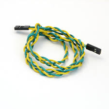
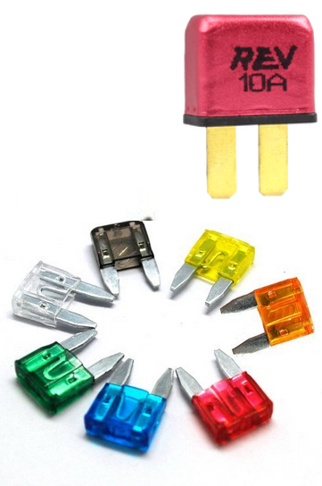

# Electrical Primer

Code's job is to write code that communicates with several different components that the electronics division wires together. While it's not required to know the inner workings of each part, wire, and protocol

A few keywords:
- Current: The "flow rate" of electrons
- Amperage: A measurement of current
- Voltage: The "force" that makes electrical flow

## Introduction To FRC Electronics

Code's job is to write code that communicates with several different components that the electronics division wires together. While it's not required to know the inner workings of each part, knowing what each part does and how its connected will make it wasy easier to work with those components.

The above diagram shows several common parts on FRC robots. While we don't use all of them, there are several you should be familiar with:

- [Voltage Regular Module (VRM)](https://docs.wpilib.org/en/stable/docs/controls-overviews/control-system-hardware.html#ctre-voltage-regulator-module)
  - Responsible for delivering regulatd power to important devices, 
- [RoboRIO](https://docs.wpilib.org/en/stable/docs/controls-overviews/control-system-hardware.html#ni-roborio)
  - The RoboRIO is the "brains" of the robot. It's responsible for running our code and facilitating communication between all other devices.
- [SparkMAX](https://docs.wpilib.org/en/stable/docs/controls-overviews/control-system-hardware.html#spark-max-motor-controller)
  - A SparkMAX is a motor controller that interfaces between certain motors and CAN. We communicate with the SparkMAX over CAN and then the SparkMAX translates our instructions to voltages the motor can understand.
- [Power Distribution Hub (PDH)](https://docs.wpilib.org/en/stable/docs/hardware/hardware-basics/status-lights-ref.html)
  - The PDH is one of the first component that power from the battery reaches (directly after the 120A breaker)
- [Robot Signal Light (RSL)](https://docs.wpilib.org/en/stable/docs/controls-overviews/control-system-hardware.html#ctre-voltage-regulator-module)
  - The RSL is a signal light that is used to communicate if the robot is off, on, and if it's on, enabled.
  - These 3 states are represented by:
    - Solid light: On, disabled
    - Blinking light: On, enabled
    - Off: No power to the robot
- [Radio](https://docs.wpilib.org/en/stable/docs/controls-overviews/control-system-hardware.html#openmesh-om5p-an-or-om5p-ac-radio)
  - While this specific model is slowly being replaced, it still serves the purpose of letting us communicate with the roboRIO
- [Radio Power Module (RPM)](https://docs.wpilib.org/en/stable/docs/controls-overviews/control-system-hardware.html#rev-radio-power-module)
  - While the RPM is not always used, it's one of two major ways to power the radio (the other one being a power connector located on the radio)
- [120A Breaker](https://docs.wpilib.org/en/stable/docs/controls-overviews/control-system-hardware.html#ctre-voltage-regulator-module)
  - This breaker is the on/off switch for the robot. It is usually near the edge of the robot so it's easier to enable and disable.
- [Limelight](https://limelightvision.io/)
  - Not shown in the above control system map, the Limelight is a brand of FRC camera that is used on our robot for both computer vision and as a camera used by the driver. (possibly multiple are used)

## CAN 

CAN (Control Area Network) is a protocol used to send data between different devices on the robot. It is a daisy-chained system, which means that its technically just two long intertwined wires going from one device to the next.

Due to CAN's nature of each connection relying on the previous one, *any break* in the chain can cause undesired behavior.

Every Device on a CAN network has a unique **id**. **This can be any number, but it's good practice to keep them under 40.** When you hear someone referencing something's CAN id, this is what they are referring to.

## Motors

There are 2 types of motors mainly used in FRC. These are motors *with* built-in controllers as well as motors *without* built-in controllers.

We also conveniently use 2 brands of motor:
- CTRE (Controllers built-in)
  - [Kraken X60](https://store.ctr-electronics.com/kraken-x60/)
    - An extremely powerful motor, often used for drivetrains and high torque applications.
  - [Falcon 500](https://store.ctr-electronics.com/falcon-500-powered-by-talon-fx/)
    - Still extremely powerful with high torque, slightly weaker than the Kraken X60.
- NEO (External controller needed)
  - Neo V1.1
    - A general workhorse motor, used throughout our robot on common mechanisms.
  - Neo 550
    - Very tiny motor. High speed, low torque.

> Both of the CTRE motors we use have a built-in controller called a talo

## Breakers & Fuses

Breakers are used to protect electrical components from recieving too much electricity at any given time. Electrical fuses are placed within a circuit as a weak point so that if a high electrical current from an overload or short circuit occurs, the fuse is sacrificed and breaks the circuit it is in.

This image shows several fuses along with one (10 amp) breaker:
\

## More Resources

[Lynx Library Of Knowledge](https://docs.lynkrobotics.org/electrical/beginnerElectrical.html)

