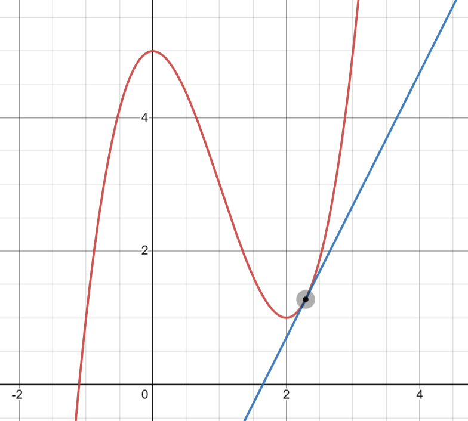
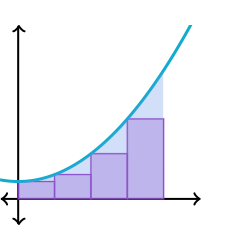

# PID

The PID controller is a common *feedback* controller consisting of 3 terms: proportional, integral, and derivative. You don't need to know what an integral/derivative is or how it works, only that they are used in PID controllers.

## Why?
It's important to understand that when we're interfacing with electrical components (in this case, motors) the motor has no idea how to get to a certain speed or position. All the motor can do is take a given voltage and convert it to rotational speed. We need a PID controller to be able to set a motor's position or speed *instead* of an instantaneous voltage that's sent to the motor.

>The motor is still being controlled using a voltage, the PID controller just calculates the voltage that the motor needs to smoothly approach the desired state.

Some common examples of when to use a PID controller include:
- Controlling the speed / position of a motor
- Controlling the heading of a robot

> A feedback controller refers to a controller that *responds* to interference (error), we'll cover controllers that can *predict* interference before it happens

We'll explain PID controllers by going through each term individually, building off the term before it.

## Important Terms

Before explaining each term, keep in mind these definitions:
- Setpoint: Where the PID controller wants to be; it's goal (sometimes called the reference).
- Output: Slightly counterintuitive, the Output is the current value of the controller's current state. The motor's **current** position, speed, voltage, etc.
- Error: Error is defined as the difference between the Output and the Setpoint.
- Control Effort: The current output of the PID controller, when controlling a motor this is usually a voltage that is then sent to the motor.

## The Proportional Term

The proportional term attempts to drive the error to zero by contributing to the control signal proportionally to the current error. Intuitively, this tries to move the output towards the reference.

Essentially, as error decreases (the output approaches the setpoint), the proportional term decreases.

## The Derivative Term

>The derivative is just the rate of change over an infinitesimal (very small) time period, or the rate of change/slope for an instant.

The derivative term tries to drive the rate of change, or the *derivative* of the error to zero by contributing to the control signal proportionally to the derivative of the error. 

Essentially, as the rate of change of the error approaches its setpoint (the rate of change of the setpoint), this term approaches zero.

If the setpoint is constant, the derivative setpoint is zero, so the derivative term acts as a "software-defined damper", which slows down systems in motion.

## The Integral Term

> The integral of a function just represents the area between the graph and the x-axis. It can be approximated using rectangles, which is how PID controllers take integrals.

The integral term is where PID control can become complicated. It is often not needed, and can sometimes be replaced by another method of control called *feed forward*. The integral term can make controllers behave in unexpected ways, and is difficult to tune.

The integral term is used to eliminate what is known as steady-state error. Steady-state error is error after the system reaches equillibrium, or if the system stops moving before reaching the setpoint.

The can be caused by things like gravity or friction overcoming the control effort being exerted. The integral term is one way of resolving this.

In a PID controller, the integral term is proportional to the sum of all of the past error measurements. 

Essentially, the integral increases the control effort until the system reaches the setpoint.

For more information about the integral term and potential pitfalls, see [WPILib Docs](https://docs.wpilib.org/en/stable/docs/software/advanced-controls/introduction/introduction-to-pid.html).

For a more detailed overview of all of the math involved, see [this page](https://docs.wpilib.org/en/stable/docs/software/advanced-controls/introduction/introduction-to-pid.html).

For a very detailed, college level overview (not neceessary at all for our use but cool) see [Controls Engineering in FRC](https://file.tavsys.net/control/controls-engineering-in-frc.pdf).